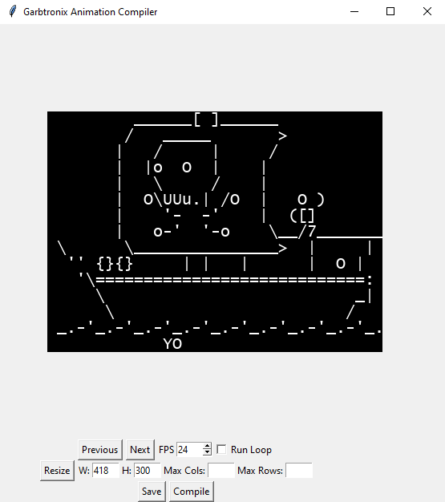

# Garbtronix Animation Library

My Personal ASCII animation tool
Able to build GIFS and MP4's straight from text.


<sup>Built from this very suite.</sup>

### Setup ###

- Install Python 3 latest
- Pip Install Dependancies
    - ```pip install Pillow```

    <sup>Does all of our GIF and IMG building</sup>
    - ```pip install numpy```
    - ```pip install opencv-python```
    
    <sup>Both of these are exclusively for MP4 generation</sup>
- create the file ```<root>/pythonGifBuilder/example.txt```
    - This is used for parsing our ascii art
- Run ```python3 <root>/pythonGifBuilder/main.py```
    - If it runs, great we've done it!



### How It Works ###

The application has 2 main important file standards with their own special markup language which get read.

- <b>PRE-COMPILED</b>
    - a program/markup language file which allows for object definition and scene composition.
    - This only produces output for the OTHER markup language.
- <b>POST-COMPILED</b>
    - A simple file which displays every frame that will be generated into an image

The standard workflow is as follows:

    - (Optional) Build a pre-compiled file and compile it
        - Good for complex scenes and stories
    - Generate a post-compile file
        - This is raw frames and for very small animations this is far easier!
    - Open pythonGifBuilder
    - Edit sizing, FPS, font, etc in pythonGifBuilder
    - Save and enjoy.

TL;DR -> Pre,Post,Build.

#### Post Compiled File Standard ####

The format for these files is DEAD. SIMPLE. Let's take a look at a 2 frame animation:
```
0,1
*
  .--.
  | oo
  | >|
  `_-/
**
1,1
*
  .--.
  | oo
  | >|
  `_O/
**
```
Starting with line 1 we have a metadata line.
- 0,1
    - 0 : our drawing number. Honestly this can be any number its just for reference.
    - 1 : how many "frames" we want this drawing to last. Must be a number.
    - ex: 44,20 would mean we are on drawing 44 and we want it to last 20 frames.
- *
    - This is our beginning of drawing reference. Must be the only character on the line.
- The next part is our drawing.
- **
    - This is our end of drawing reference. Must be the only character on the line.
- We than clearly rinse repeat.

Here's the output of the example above

